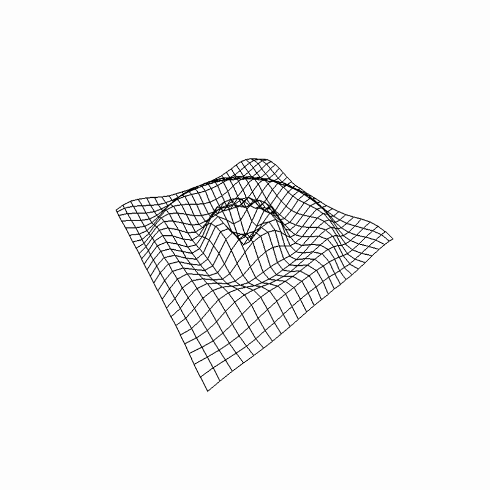
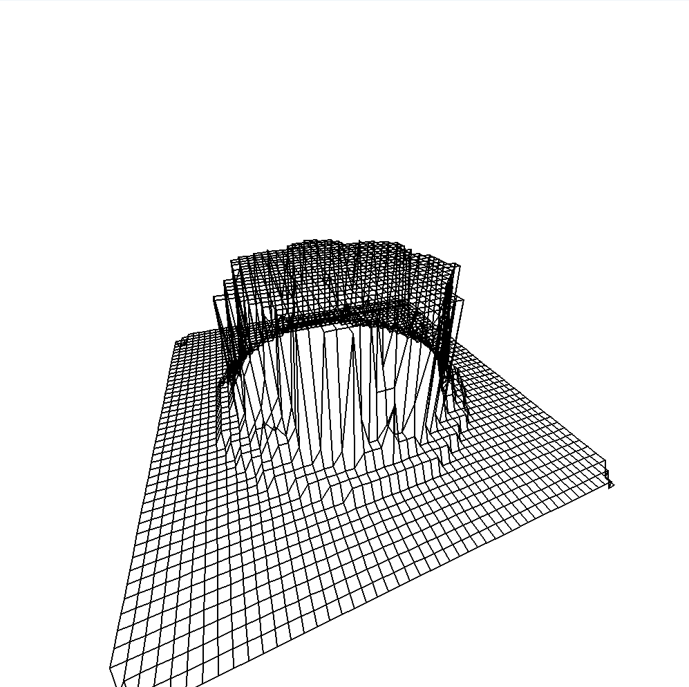
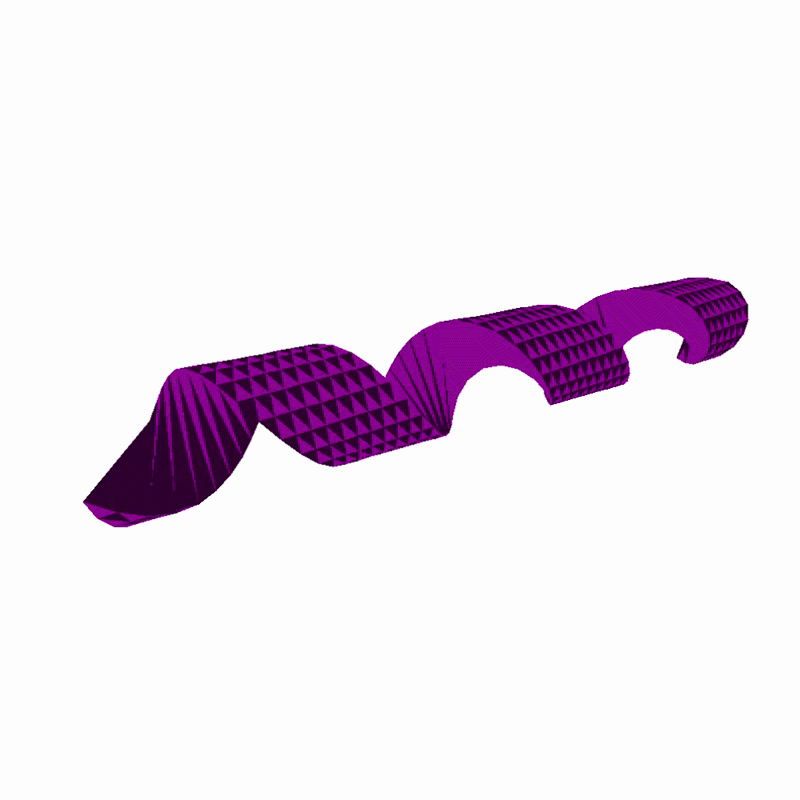
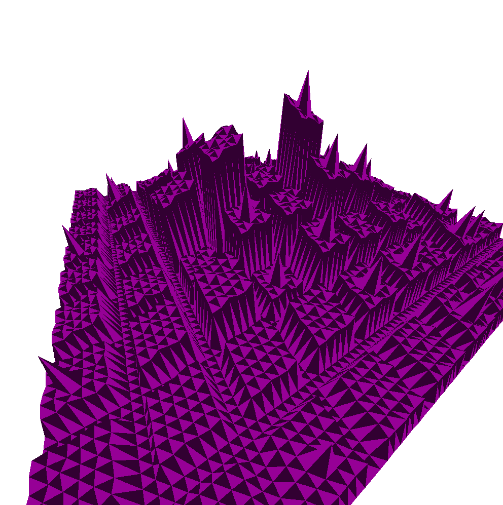
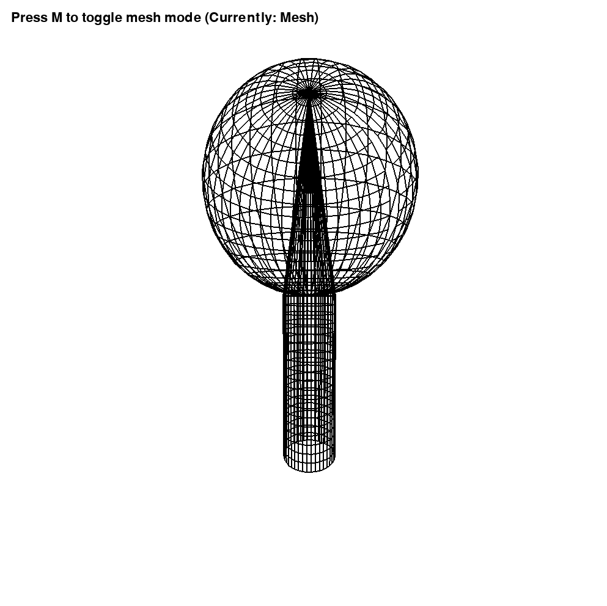
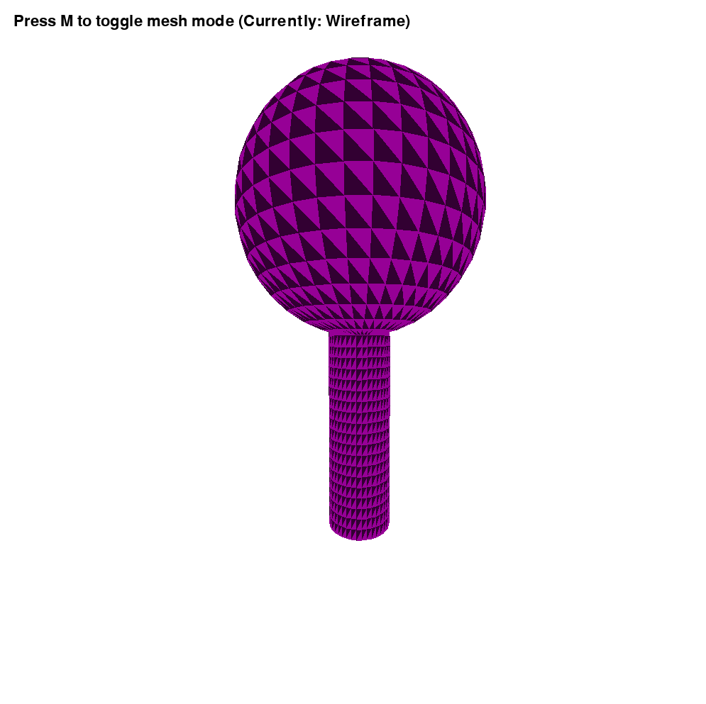
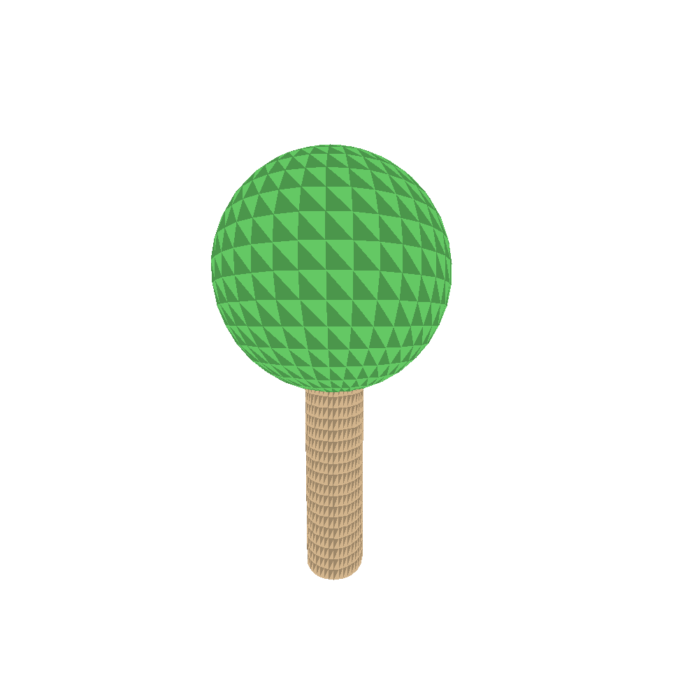
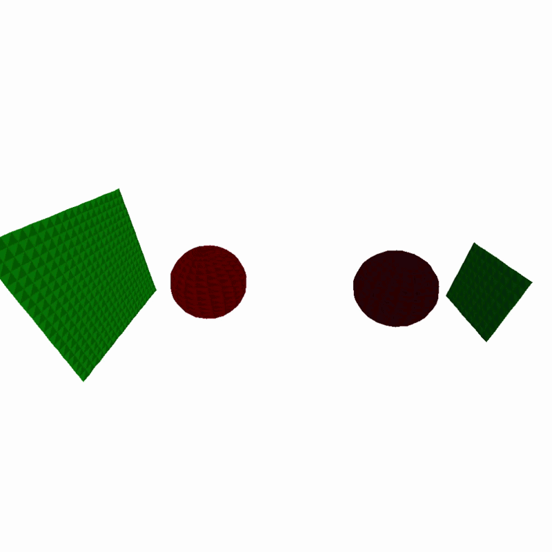
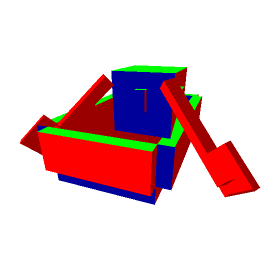
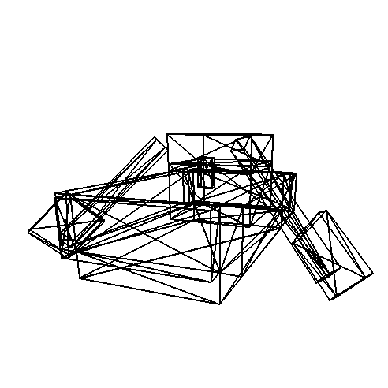

<div align="center">

[](https://pepy.tech/projects/aiden3drenderer)
[](https://pypi.org/project/aiden3drenderer/)
[](https://pypi.org/project/aiden3drenderer/)
[](https://github.com/AidenKielby/3D-mesh-Renderer/blob/main/LICENSE)
[](https://pypi.org/project/aiden3drenderer/)
[](https://github.com/AidenKielby/3D-mesh-Renderer/stargazers)
[](https://<github.com/AidenKielby/3D-mesh-Renderer/commits/main)

</div>

# Aiden3DRenderer
A lightweight 3D wireframe renderer built with Pygame featuring custom projection, first-person camera controls, and 15+ procedural terrain generators.

## Features

- **Custom 3D projection** - Perspective projection without using external 3D libraries
- **First-person camera** - Full 6-DOF camera movement with mouse look
- **15+ procedural generators** - Mountains, cities, fractals, and mathematical surfaces
- **Real-time rendering** - 60 FPS wireframe rendering
- **Animated terrains** - Several terrains feature time-based animations
- **Extensible API** - Easy to create and register custom shapes with decorators
- **Multiple Object Support** - Render multiple shapes at the same time
- **Custom Colors** - Ability to change colors on a per shape basis
- **Simple Physics Engine** - easy to add physics to your render
- **Obj Model Loading** - simple obj model loading
- **Simple Rasterization** - simple and slow rasterization for video_renderer, GPU optimized for renderer
- **⚠️DISCLAIMER⚠️** - GPU rasterization does not currently work on mac as mac does not support compute shaders (GL 4.3) :(

## Gallery

<div align="center">
  <table>
    <tr>
      <td align="center">
        
        <br/>
        <b>Ripple Effect</b>
        <br/>
        <i>Expanding waves from center</i>
      </td>
      <td align="center">
        
        <br/>
        <b>Mandelbulb Slice</b>
        <br/>
        <i>3D fractal cross-section</i>
      </td>
    </tr>
    <tr>
      <td align="center">
        
        <br/>
        <b>Turning Spiral</b>
        <br/>
        <i>Screw like shape spinning</i>
      </td>
      <td align="center">
        
        <br/>
        <b>Simple City (laggy when solid render)</b>
        <br/>
        <i>City preset in solid render</i>
      </td>
      <tr>
      <td align="center">
        
        <br/>
        <b>Tree Mesh</b>
        <br/>
        <i>Tree render from tree_example.py in examples</i>
      </td>
      <td align="center">
        
        <br/>
        <b>Tree Solid Render</b>
        <br/>
        <i>Tree render from tree_example.py in examples</i>
      </td>
    </tr>
    <tr>
      <td align="center">
        
        <br/>
        <b>Colored Tree</b>
        <br/>
        <i>Tree render from tree_example.py in examples (with color update)</i>
      </td>
      <td align="center">
        
        <br/>
        <b>Physics Demo</b>
        <br/>
        <i>Physics Demo from physics_test.py in examples</i>
      </td>
    </tr>
    <tr>
      <td align="center">
        
        <br/>
        <b>Minecraft Boat Filled</b>
        <br/>
        <i>OBJ file renderer showcase</i>
      </td>
      <td align="center">
        
        <br/>
        <b>Minecraft Boat Wireframe</b>
        <br/>
        <i>OBJ file renderer showcase</i>
      </td>
    </tr>
  </table>
</div>

## Installation

```bash
pip install aiden3drenderer
```

Requires Python 3.11+ and automatically installs Pygame 2.6.0+
(only tested with Python 3.11)

## Quick Start

### Running the Demo

#### Original Demo
```python
from aiden3drenderer import Renderer3D, renderer_type

# Create and run the renderer with all built-in shapes
renderer = Renderer3D()
# renderer = Renderer3D(title="Custom Shapes Demo", load_default_shapes=False)
# Above would give the renderer that title and the renderer would not use default shapes
renderer.camera.position = [0, 0 ,0]
# is_mesh = True for mesh, False for solid colors
renderer.render_type = renderer_type.POLYGON_FILL
renderer.run()
```

#### Looped Demo
```python
from aiden3drenderer import Renderer3D, renderer_type

# Create and run the renderer with all built-in shapes
renderer = Renderer3D()
renderer.camera.position = [0, 0 ,0]
# is_mesh = True for mesh, False for solid colors
renderer.render_type = renderer_type.POLYGON_FILL

while True:
    # renderer.set_use_default_shapes(bool)
    # Above can be used to set the using of default shapes at runtime
    renderer.loopable_run()
```

### Looped Run Usage Example
```python
from aiden3drenderer import Renderer3D, renderer_type

# Create and run the renderer with all built-in shapes
# Simple gravity with set floor height
renderer = Renderer3D()
renderer.camera.position = [0, 0 ,0]
renderer.render_type = renderer_type.POLYGON_FILL
gravity = 0.05
floor_height = 0.1
camera_height = 2

while True:
    if renderer.camera.position[1] <= floor_height + camera_height:
        renderer.camera.position[1] = floor_height + camera_height
    else:
        renderer.camera.position[1] -= gravity
    renderer.loopable_run()
```


### Creating Custom Shapes

To create custom shapes compatible with this 3D mesh renderer, you must write Python functions decorated with `@register_shape`, each returning a "vertex matrix"—a list of rows, where each row is a list of 3D coordinate tuples (x, y, z). Each row represents a contiguous horizontal strip of points on your 3D shape, stacked along the "y" (vertical) dimension. All rows in the matrix must have the **same number of points** (columns); do not generate jagged matrices or append rows of different lengths, as the renderer expects a perfect rectangle to traverse for drawing wireframes and faces.

Points are usually arranged such that `matrix[row][col]` gives the (x, y, z) of the point at column `col` in row `row`. Loops that fill your matrix should ensure that each sub-list (row) is always the full width—pad with `None` or duplicate valid coordinates if needed, but empty or missing values will cause indexing errors. Avoid using polar or arbitrary arrangements for each row: either fill every cell with an (x, y, z) tuple, or, if the shape doesn't naturally fit a rectangle (e.g., cones/canopies), pad shorter rows to the full length to maintain a perfect rectangle.

Your function should accept at least the two arguments `grid_size` (which determines the overall scale and discretization) and `frame` (for animation support; ignored if not animating), and always return the correctly-sized 2D matrix ready for rendering. If any row in your matrix is shorter than the others, or you index cells that do not exist, you will get `IndexError: list index out of range`. Review your logic to ensure each row always contains the expected number of vertices, and debug with simple cubes or grids first to be confident in your shape's layout.

To render multiple shapes at the same time, simply have the shapes use the same key press activation as another shape.

#### Simple Shapes
```python
from aiden3drenderer import Renderer3D, register_shape
import pygame

# Register a custom shape with a decorator
# @register_shape("My Plane", key=pygame.K_p, is_animated=False) would have default purple colors
@register_shape("My Plane", key=pygame.K_p, is_animated=False, color=(200, 255, 150))
def generate_pyramid(grid_size=40, frame=0):
  """Generate a simple plane."""
  matrix = [
    [(1,1,1), (2,1,1), (3,1,1)],
    [(1,1,2), (2,1,2), (3,1,2)],
    [(1,1,3), (2,1,3), (3,1,3)]
]
  return matrix

# Run the renderer (your shape will be available on 'P' key)
renderer = Renderer3D()
renderer.run()
```

#### Complex Shapes
```python
from aiden3drenderer import Renderer3D, register_shape
import pygame

# Register a custom shape with a decorator
@register_shape("My Pyramid", key=pygame.K_p, is_animated=False)
def generate_pyramid(grid_size=40, frame=0):
  """Generate a simple pyramid."""
  matrix = []
  center = grid_size / 2
    
  for x in range(grid_size):
    row = []
    for y in range(grid_size):
      # Distance from center
      dx = abs(x - center)
      dy = abs(y - center)
      max_dist = max(dx, dy)
            
      # Height decreases with distance
      height = max(0, 10 - max_dist)
      row.append(height)
    matrix.append(row)
    
  return matrix

# Run the renderer (your shape will be available on 'P' key)
renderer = Renderer3D()
renderer.run()
```

## Physics
### About

The physics engine in Aiden3DRenderer provides a simple but extensible framework for simulating basic 3D physics interactions. It supports rigid body dynamics for spheres and planes, including gravity, velocity, and collision detection/response. The system allows you to:

- Add physical objects (spheres, planes) to your scene with mass, size, and color
- Apply forces (like gravity or impulses) to objects
- Simulate collisions between spheres and with planes (walls, floor, etc.)
- Attach a physics-enabled camera that can move and collide with the environment
- Easily manage all physics objects using a handler class

This makes it easy to create interactive demos, simple games, or visualizations where objects move and bounce realistically within a 3D environment. The physics system is designed to be lightweight and easy to integrate with the renderer, while remaining flexible for custom extensions.

### Examples:

#### 2 balls colliding:
```python
from aiden3drenderer import Renderer3D, register_shape, physics, renderer_type
import pygame
import math


def main():
    # Create the renderer
    renderer = Renderer3D(width=1000, height=1000, title="My 3D Renderer")

    # Add physics shapes
    shape = physics.ShapePhysicsObject(renderer, "sphere", (0,0,0), (100, 0, 0), 5, 20, 20)
    shape.add_forces((-0.7, 0, 0))
    shape.anchor_position = [20, 0, 0]

    shape1 = physics.ShapePhysicsObject(renderer, "sphere", (0,0,0), (50, 0, 0), 5, 10, 20)
    shape1.add_forces((0.7, 0, 0))
    shape1.anchor_position = [0, 0, 0]

    # Create object handler
    obj_handler = physics.PhysicsObjectHandler()

    # Add all shapes
    obj_handler.add_shape(shape)
    obj_handler.add_shape(shape1)

    # Set starting shape (optional)
    renderer.set_starting_shape(None)

    renderer.camera.position = [0, 0 ,0]
    renderer.render_type = renderer_type.POLYGON_FILL
    # Run the renderer

    while True:
        obj_handler.handle_shapes()
        renderer.loopable_run()


if __name__ == "__main__":
    main()

```

#### 2 balls in a box, camera physics too:
```python
from aiden3drenderer import Renderer3D, physics, renderer_type


def main():
    # Create the renderer
    renderer = Renderer3D(width=1000, height=1000, title="My 3D Renderer")

    obj_handler = physics.PhysicsObjectHandler()

    plane_color = (200, 200, 200)
    plane_size = 28  # Slightly larger box
    grid_size = 8    # Slightly higher resolution
    obj_handler.add_plane(renderer, [0, -14, 0], (0, 0, 0),   plane_color, plane_size, grid_size)  # floor
    obj_handler.add_plane(renderer, [-14, 0, 0], (0, 0, 90),  plane_color, plane_size, grid_size)  # left
    obj_handler.add_plane(renderer, [14, 0, 0],  (0, 0, 90),  plane_color, plane_size, grid_size)  # right
    obj_handler.add_plane(renderer, [0, 0, -14], (90, 0, 0),  plane_color, plane_size, grid_size)  # back
    obj_handler.add_plane(renderer, [0, 0, 14],  (90, 0, 0),  plane_color, plane_size, grid_size)  # front

    # Create two balls (spheres) inside the box
    ball_color = (100, 100, 255)
    ball_radius = 4   # Slightly larger balls
    ball_mass = 2.5
    ball_grid = 8     # Slightly higher resolution

    ball1 = physics.ShapePhysicsObject(renderer, "sphere", (0, 0, 0), ball_color, ball_radius, ball_mass, ball_grid)
    ball1.anchor_position = [0, 0, 0]
    
    ball2 = physics.ShapePhysicsObject(renderer, "sphere", (0, 0, 0), ball_color, ball_radius, ball_mass, ball_grid)
    ball2.anchor_position = [9, 0, 0]

    # Gravity force (downwards)
    gravity = (0, -0.18, 0)
    ball1.add_forces((1,0,1))

    camera = physics.CameraPhysicsObject(renderer, renderer.camera, 1, 10)

    obj_handler.add_camera(camera)

    # Add balls
    obj_handler.add_shape(ball1)
    obj_handler.add_shape(ball2)

    renderer.set_starting_shape(None)
    renderer.render_type = renderer_type.POLYGON_FILL
    renderer.camera.base_speed = 1.2

    while True:
        
        ball1.add_forces(gravity)
        ball2.add_forces(gravity)
        camera.add_forces(gravity*100)
        obj_handler.handle_shapes()
        renderer.loopable_run()


if __name__ == "__main__":
    main()
```

## Obj Loading
### Examples:
```python
from aiden3drenderer import Renderer3D, obj_loader, renderer_type

def main():
    # Create the renderer
    renderer = Renderer3D(width=1000, height=1000, title="My 3D Renderer")
    
    # Set starting shape (optional)
    renderer.current_shape = None

    renderer.camera.position = [0, 0, 0]
    renderer.render_type = renderer_type.POLYGON_FILL
    renderer.using_obj_filetype_format = True

    obj = obj_loader.get_obj("./assets/alloy_forge_block.obj")
    #print(obj)

    renderer.vertices_faces_list.append(obj)
    # Run the renderer

    renderer.run()


if __name__ == "__main__":
    main()
```

### About:
You can import 3D models from .obj files as shown above, however the rendering is very glitchy. I've tried fixing it for a very long time but am unable. Assistance/feedback is greatly apreciated.

## Video Renderer

A lightweight video renderer was added to convert OBJ models into video frames using the same projection pipeline as the main renderer. It supports per-object rotations and basic per-triangle rasterization.

- **Status:** experimental — not very fast yet and currently shows some rasterization artifacts (visible seams and occasional overdraw). These issues are known and will be fixed in future updates.

### Basic usage

```python
from aiden3drenderer.video_renderer import VideoRenderer3D, VideoRendererObject

# Create an object wrapper pointing to an OBJ file
obj = VideoRendererObject("assets/alloy_forge_block.obj")
# rotations_per_seccond is degrees-per-second around X, Y, Z
obj.rotations_per_seccond = [10, 25, 0]
obj.rotation = [0, 0, 0]

# Create renderer and render a short clip
vr = VideoRenderer3D(width=800, height=600, fps=30, shapes=[obj])
vr.render("out.avi", duration_s=5, verbose=True)
```

### Multiple objects / advanced

```python
from aiden3drenderer.video_renderer import VideoRenderer3D, VideoRendererObject

o1 = VideoRendererObject("assets/model1.obj")
o1.rotations_per_seccond = [0, 40, 0]

o2 = VideoRendererObject("assets/model2.obj")
o2.rotations_per_seccond = [10, 0, 5]

# when having multiple objects, for now the farther object must be put first th the list
vr = VideoRenderer3D(width=1200, height=800, fps=24, shapes=[o2, o1])
vr.render("multiples.avi", duration_s=10, verbose=True)
```

Notes & tips:

- For now, prefer lower resolutions (e.g., 800×600) and lower FPS while the renderer is being optimized.
- If you see seams or diagonal artifacts, those are rasterization/draw-order issues; sorting faces by depth or switching to OpenCV polygon fills can remove most artifacts.
- The `VideoRenderer3D` API is experimental and may change; contributions and PRs are welcome.


## Controls

### Camera Movement
- **W/A/S/D** - Move forward/left/backward/right
- **Space** - Move up
- **Left Shift** - Move down
- **Left Ctrl** - Speed boost (2x)
- **Arrow Keys** - Fine pitch/yaw adjustment
- **Right Mouse + Drag** - Look around (pitch and yaw)

### Terrain Selection
- **1** - Mountain terrain
- **2** - Animated sine waves
- **3** - Ripple effect
- **4** - Canyon valley
- **5** - Stepped pyramid
- **6** - Spiral surface
- **7** - Torus (donut)
- **8** - Sphere
- **9** - Möbius strip
- **0** - Megacity (80×80 procedural city)
- **Q** - Alien landscape
- **E** - Double helix (DNA-like)
- **R** - Mandelbulb fractal slice
- **T** - Klein bottle
- **Y** - Trefoil knot

### Other
- **Escape** - Quit application

## Terrain Descriptions

### Static Terrains

**Mountain** (1) - Smooth parabolic mountain with radial falloff

**Canyon** (4) - U-shaped valley with sinusoidal variations

**Pyramid** (5) - Stepped pyramid using Chebyshev distance

**Torus** (7) - Classic donut shape using parametric equations

**Sphere** (8) - UV sphere using spherical coordinates

**Möbius Strip** (9) - Non-orientable surface with a single side

**Megacity** (0) - 80×80 grid with hundreds of procedurally generated buildings
- Buildings get taller toward the center
- 8×8 block system with roads
- Random antenna towers on some buildings
- Most complex terrain (6400 vertices)

**Mandelbulb** (R) - 2D slice of 3D Mandelbulb fractal
- Uses power-8 formula
- Height based on iteration count

**Klein Bottle** (T) - 4D object projected into 3D
- Non-orientable surface
- No inside or outside

**Trefoil Knot** (Y) - Mathematical knot in 3D space
- Classic topology example
- Tube follows trefoil path

### Animated Terrains

**Waves** (2) - Multiple overlapping sine waves
- Three different wave frequencies
- Constantly flowing motion

**Ripple** (3) - Expanding ripple from center
- Exponential amplitude decay
- Simulates water drop impact

**Spiral** (6) - Rotating spiral pattern
- Polar coordinate mathematics
- Hypnotic rotation

**Alien Landscape** (Q) - Complex multi-feature terrain
- Crater with parabolic profile  
- Crystalline spike formations
- Rolling hills
- Procedural "vegetation" spikes
- Pulsating energy field

**Double Helix** (E) - DNA-like structure
- Two intertwined strands
- 180° phase offset between strands
- Rotates over time

## Technical Details

### 3D Projection Pipeline

1. **World coordinates** - Raw vertex positions
2. **Camera translation** - Subtract camera position
3. **Camera rotation** - Apply yaw, pitch, roll transformations
4. **Perspective projection** - Divide by Z-depth with FOV
5. **Screen mapping** - Convert to pixel coordinates

### Rotation Matrices

Yaw (Y-axis):
```
x' = x·cos(θ) + z·sin(θ)
z' = -x·sin(θ) + z·cos(θ)
```

Pitch (X-axis):
```
y' = y·cos(φ) - z·sin(φ)
z' = y·sin(φ) + z·cos(φ)
```

Roll (Z-axis):
```
x' = x·cos(ψ) - y·sin(ψ)
y' = x·sin(ψ) + y·cos(ψ)
```

### Culling

Points behind the camera (z ≤ 0.1) are set to `None` to prevent rendering artifacts and negative depth division.

## Performance

- **60 FPS** stable on most terrains
- **Megacity** (6400 vertices) - Largest terrain, still maintains 60 FPS (wireframe mesh only)
- Wireframe rendering and filled polygons from triangle partitions

## API Reference

### Renderer3D

Main renderer class that handles the 3D projection and rendering loop.

```python
from aiden3drenderer import Renderer3D

renderer = Renderer3D(
    width=1200,      # Window width in pixels
    height=800,      # Window height in pixels
    fov=800          # Field of view (higher = less perspective)
)
renderer.run()
```

### Camera

Camera class for position and rotation control (automatically created by Renderer3D).

```python
from aiden3drenderer import Camera

# Access camera through renderer
renderer = Renderer3D()
camera = renderer.cam

# Camera attributes
camera.pos          # [x, y, z] position
camera.facing       # [yaw, pitch, roll] in radians
camera.speed        # Movement speed (default: 0.5)
```

### register_shape Decorator

Register custom shape generators that appear in the renderer.

```python
@register_shape(name, key=None, is_animated=False)
def generate_function(grid_size=40, frame=0):
    """
    Args:
        name (str): Display name for the shape
        key (pygame.K_*): Keyboard key to trigger shape (optional)
        is_animated (bool): Whether shape changes over time
        
    Returns:
        list[list[float]]: grid_size x grid_size matrix of heights
    """
    return matrix
```

## Package Structure

```
aiden3drenderer/
├── __init__.py          # Package exports
├── renderer.py          # Renderer3D class and projection
├── camera.py            # Camera class for movement/rotation
└── shapes.py            # 15+ built-in shape generators

examples/
├── basic_usage.py       # Simple demo
└── custom_shape_example.py  # Custom shape tutorial
```

## Development

### Running from Source

```bash
git clone https://github.com/AidenKielby/3D-mesh-Renderer
cd 3D-mesh-Renderer
pip install -e .
python examples/basic_usage.py
```

### Building the Package

```bash
pip install build twine
python -m build
python -m twine upload dist/*
```

## Credits

Created by Aiden. Most procedural generation functions created with AI assistance (the things like mountain and megacity). All the rest (rendering, projection, and camera code, etc.) written manually.

## License

MIT


