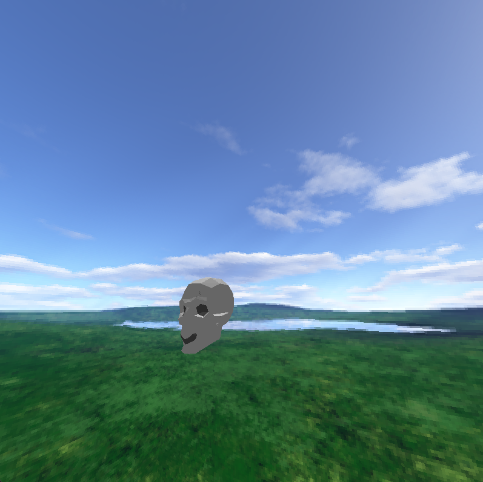

<div align="center">

[](https://pepy.tech/projects/aiden3drenderer)
[](https://pypi.org/project/aiden3drenderer/)
[](https://pypi.org/project/aiden3drenderer/)
[](https://github.com/AidenKielby/3D-mesh-Renderer/blob/main/LICENSE)
[](https://pypi.org/project/aiden3drenderer/)
[](https://github.com/AidenKielby/3D-mesh-Renderer/stargazers)
[](https://github.com/AidenKielby/3D-mesh-Renderer/commits/main)

</div>

# Aiden3DRenderer

Interactive 3D playground for learning math, Python, and GPU shaders from first principles.

No graphics background required. If you can write basic Python, you can build and understand 3D scenes here.

> If this project teaches you something useful, please give it a star. It helps a ton and keeps this passion project growing.

## A quick note

I built this because I wanted 3D graphics to feel less "mystical" and more hands-on.
So instead of hiding the pipeline behind a giant engine, this project keeps the core ideas visible: projection math, shape generation, shader logic, and simulation.

If you are learning, tinkering, or teaching with this repo, that is exactly what it was made for.

## Who is this for?

- **Math/CS students** who want to visualize 3D functions by writing one Python function.
- **Python learners** who want a visual project with instant feedback instead of only terminal output.
- **Aspiring graphics developers** who want to write a first GLSL (OpenGL Shader Lanuage) shader with a plug-and-play setup.

## Gallery

<div align="center">
  <table>
    <tr>
      <td align="center">
        
        <br/>
        <b>Ripple Surface</b>
      </td>
      <td align="center">
        
        <br/>
        <b>Animated Spiral</b>
      </td>
    </tr>
    <tr>
      <td align="center">
        
        <br/>
        <b>Physics Playground</b>
      </td>
      <td align="center">
        
        <br/>
        <b>Rasterized Skull</b>
      </td>
    </tr>
  </table>
</div>

## Why people love this project

- Built from scratch in Python for education: the projection pipeline is implemented manually so you can read it and understand it.
- You can visualize almost any mathematical surface by writing one function with `@register_shape`.
- You can write GLSL compute/post shaders without heavy engine boilerplate.
- Includes camera controls, OBJ loading, texture mapping, and a compact physics system for experimentation.

## Start in 60 seconds

```bash
pip install aiden3drenderer
```

```python
from aiden3drenderer import Renderer3D, renderer_type

renderer = Renderer3D()
renderer.render_type = renderer_type.POLYGON_FILL
renderer.run()
```

## Visualize any math function

You define a shape by returning a rectangular matrix of `(x, y, z)` tuples. Decorate the function with `@register_shape`, run, and your shape appears in the scene.

### Example 1: Animated ripple

```python
import math
from aiden3drenderer import register_shape

@register_shape("Ripple", is_animated=True, color=(150, 180, 255))
def ripple(grid_size=48, frame=0):
    matrix = []
    half = grid_size / 2
    for i in range(grid_size):
        row = []
        for j in range(grid_size):
            x = (i - half) / (grid_size / 8)
            y = (j - half) / (grid_size / 8)
            r = math.hypot(x, y) + 1e-6
            z = math.sin(3.0 * r - frame * 0.12) / (1.0 + r)
            row.append((x, z, y))
        matrix.append(row)
    return matrix
```

### Example 2: Gaussian hill

```python
import math
from aiden3drenderer import register_shape

@register_shape("Gaussian Hill", is_animated=False, color=(220, 220, 220))
def gaussian_hill(grid_size=48, frame=0):
    matrix = []
    half = grid_size / 2
    for i in range(grid_size):
        row = []
        for j in range(grid_size):
            x = (i - half) / (grid_size / 6)
            y = (j - half) / (grid_size / 6)
            z = math.exp(-(x * x + y * y))
            row.append((x, z, y))
        matrix.append(row)
    return matrix
```

### Example 3: Parametric torus

```python
import math
from aiden3drenderer import register_shape

@register_shape("Torus", is_animated=False, color=(230, 180, 150))
def torus(grid_size=48, frame=0, R=1.5, r=0.45):
    matrix = []
    for i in range(grid_size):
        theta = (i / grid_size) * 2 * math.pi
        row = []
        for j in range(grid_size):
            phi = (j / grid_size) * 2 * math.pi
            x = (R + r * math.cos(phi)) * math.cos(theta)
            y = r * math.sin(phi)
            z = (R + r * math.cos(phi)) * math.sin(theta)
            row.append((x, y, z))
        matrix.append(row)
    return matrix
```

## Your first shader in 5 minutes

This is a headline feature: write a small GLSL compute shader, plug it into `CustomShader`, and run it.

### Step 1: Write GLSL

```glsl
#version 430
layout(local_size_x = 8, local_size_y = 8) in;

layout(std430, binding = 0) buffer pixels {
    vec4 data[];
};

uniform uint width;
uniform float time;

void main() {
    uint x = gl_GlobalInvocationID.x;
    uint y = gl_GlobalInvocationID.y;
    uint idx = y * width + x;
    float u = float(x) / float(width);
    data[idx] = vec4(u, 0.5 + 0.5 * sin(time + u * 10.0), 0.25, 1.0);
}
```

### Step 2: Dispatch from Python

```python
from aiden3drenderer import CustomShader

shader_src = """#version 430
layout(local_size_x = 8, local_size_y = 8) in;
layout(std430, binding = 0) buffer pixels { vec4 data[]; };
uniform uint width;
uniform float time;
void main(){
  uint x = gl_GlobalInvocationID.x;
  uint y = gl_GlobalInvocationID.y;
  uint idx = y * width + x;
  float u = float(x) / float(width);
  data[idx] = vec4(u, 0.5 + 0.5*sin(time + u*10.0), 0.25, 1.0);
}
"""

cs = CustomShader(shader_src, context=renderer.ctx)
cs.set_buffer("pixels", renderer.width * renderer.height, element_size=16)
cs.write_to_uniform("width", renderer.width)
cs.write_to_uniform("time", 0.0)

groups_x = (renderer.width + 7) // 8
groups_y = (renderer.height + 7) // 8
cs.compute_shader.run(groups_x, groups_y, 1)

pixels = cs.read_from_buffer("pixels", renderer.width * renderer.height, element_type="vec4")
```

That is enough to start building shader effects. For more, see [docs/custom_shaders.md](docs/custom_shaders.md).

## Physics playground (learn simulation by seeing it)

The physics module is intentionally lightweight and educational:

- sphere objects
- plane colliders
- gravity and custom forces
- sphere-sphere and sphere-plane collisions
- optional camera physics wrapper

Great for learning integration and collision response with immediate visual feedback.

## Pick your path

### Path A: Learn 3D math
1. Start with a built-in shape.
2. Write a custom `@register_shape` function.
3. Animate it with `frame`.

### Path B: Learn Python through visuals
1. Tweak shape loops and constants.
2. Add multiple objects in one scene.
3. Explore render modes and pause settings.

### Path C: Learn GLSL shaders
1. Copy the minimal shader above.
2. Change colors and gradients.
3. Add your shader to a scene as a post-processing step.

---

## Full technical reference (moved to the bottom)

Everything is still here, just organized so beginners see the exciting part first.

### Render modes

- `renderer_type.MESH`
- `renderer_type.POLYGON_FILL`
- `renderer_type.RASTERIZE`

Debug views in `RASTERIZE` mode:

- `toggle_depth_view(True)`
- `toggle_heat_map(True)`

### Controls

Camera movement:

- `W/A/S/D` move forward/left/backward/right
- `Space` move up
- `Left Shift` move down
- `Left Ctrl` speed boost
- mouse wheel adjusts FOV
- right mouse drag look around
- arrow keys fine pitch/yaw

Terrain selection keys:

- `1` mountain
- `2` animated waves
- `3` ripple
- `4` canyon
- `5` pyramid
- `6` spiral
- `7` torus
- `8` sphere
- `9` mobius strip
- `0` megacity
- `Q` alien landscape
- `E` double helix
- `R` mandelbulb slice
- `T` klein bottle
- `Y` trefoil knot

Other:

- `Esc` open/close pause menu in `run()` mode

### API quick reference

Core:

- `Renderer3D`
- `register_shape`
- `renderer_type`
- `object_type`

Useful renderer methods/attributes:

- `set_starting_shape(shape_name_or_none)`
- `set_use_default_shapes(bool)`
- `set_render_type(renderer_type.*)`
- `toggle_depth_view(bool)`
- `toggle_heat_map(bool)`
- `set_texture_for_raster(path)`
- `add_texture_for_raster(path)`
- `generate_cross_type_cubemap_skybox(radius, img_path)`
- `generate_cubemap_skybox(...)`
- `using_obj_filetype_format`
- `vertices_faces_list`
- `lighting_strictness`
- `entities`

### Feature docs

- API index: [docs/api.md](docs/api.md)
- Usage guide: [docs/usage.md](docs/usage.md)
- Tutorials: [docs/tutorials.md](docs/tutorials.md)
- Renderer internals: [docs/renderer.md](docs/renderer.md)
- Shapes and custom shape API: [docs/shapes.md](docs/shapes.md)
- Custom shaders: [docs/custom_shaders.md](docs/custom_shaders.md)
- Physics: [docs/physics.md](docs/physics.md)
- OBJ loader: [docs/obj_loader.md](docs/obj_loader.md)
- DAE loader: [docs/dae_loader.md](docs/dae_loader.md)
- Entities: [docs/entities.md](docs/entities.md)
- Camera: [docs/camera.md](docs/camera.md)
- Video renderer: [docs/video_renderer.md](docs/video_renderer.md)

### OBJ loading notes

- `obj_loader.get_obj(path, texture_index=0, offset=(x, y, z))`
- N-gon faces are triangulated automatically.
- UV (`vt`) data is parsed for texture mapping.

### macOS note

`RASTERIZE` mode needs OpenGL 4.3 compute shaders, which are not available on native macOS drivers.

### Development

Run from source:

```bash
git clone https://github.com/AidenKielby/3D-mesh-Renderer
cd 3D-mesh-Renderer/Aiden3DRenderer
pip install -e .
python examples/basic_usage.py
```

Build and publish:

```bash
pip install build twine
python -m build
python -m twine upload dist/*
```

## Credits

Created by Aiden.

Some procedural terrains, and most documentation was AI-assisted; core renderer, projection pipeline, camera, and packaging work are authored manually.

## License

MIT

---

If this README helped you decide to try the project, a star genuinely helps this indie project reach more learners.

